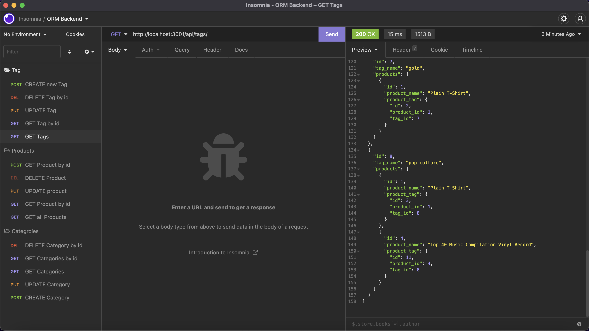
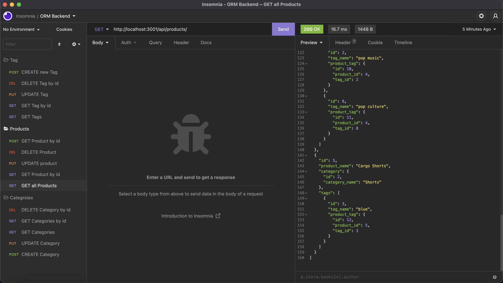
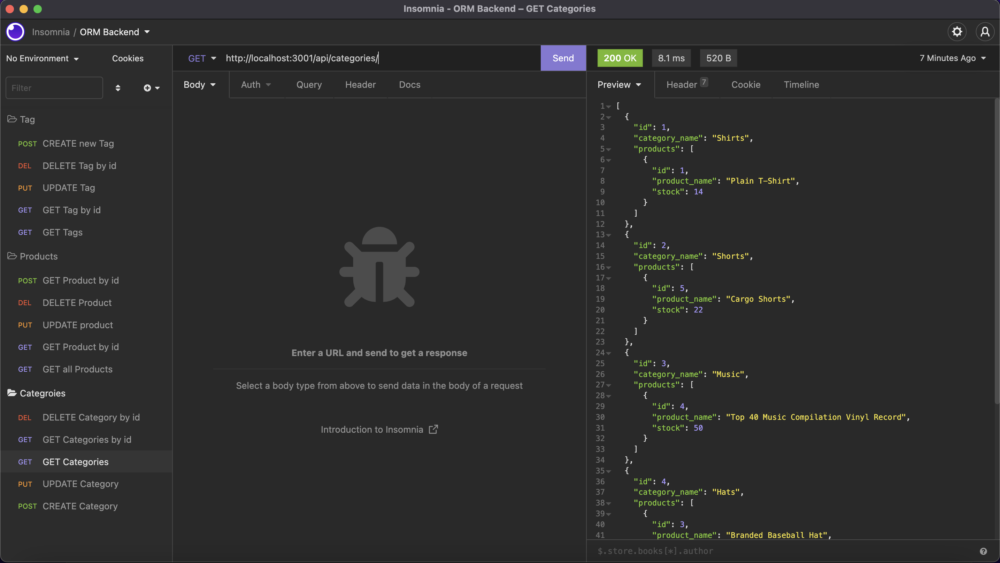

# E-commerce-backend

## Description
Internet retail, also known as e-commerce, is the largest sector of the electronics industry, having generated an estimated US$29 trillion in 2017 (Source: United Nations Conference on Trade and Development). E-commerce platforms like Shopify and WooCommerce provide a suite of services to businesses of all sizes. Due to the prevalence of these platforms, developers should understand the fundamental architecture of e-commerce sites.

Your challenge is to build the back end for an e-commerce site. You’ll take a working Express.js API and configure it to use Sequelize to interact with a MySQL database.

Here's a link to the recorded video: [E-commerce Backend](https://watch.screencastify.com/v/xw7REY7pUMMGRjfYWPTI)

## Table of Contents
  - [Description](#description)
  - [Table of Contents](#table-of-contents)
  - [User Story](#user-story)
  - [Acceptance Criteria](#acceptance-criteria)
  - [Installation](#installation)
  - [Usage](#usage)
  - [Contributing](#contributing)
  - [Questions](#questions)

## User Story
* AS A manager at an internet retail company
* I WANT a back end for my e-commerce website that uses the latest technologies
* SO THAT my company can compete with other e-commerce companies

## Acceptance Criteria
* GIVEN a functional Express.js API
* WHEN I add my database name, MySQL username, and MySQL password to an environment variable file
* THEN I am able to connect to a database using Sequelize
* WHEN I enter schema and seed commands
* THEN a development database is created and is seeded with test data
* WHEN I enter the command to invoke the application
* THEN my server is started and the Sequelize models are synced to the MySQL database
* WHEN I open API GET routes in Insomnia for categories, products, or tags
* THEN the data for each of these routes is displayed in a formatted JSON
* WHEN I test API POST, PUT, and DELETE routes in Insomnia
* THEN I am able to successfully create, update, and delete data in my database

## Installation
* Open the command line terminal and go to the proper directory
* Clone the git repo from :octocat: [kea6t](https://github.com/kea6t/E-commerce-backend/tree/main)
* Then type npm init -y to install dependencies
* Then type npm install inquirer@8.2.4
* Then npm i bcrypt
* Then npm i connect-session-sequelize
* Then npm i dotenv
* Then npm i express
* Then npm i express-handlebars
* Then npm iexpress-session
* Then npm ihandlebars
* Then npm imysql2
* Then npm isequelize
* Then enter: "node server" to launch 🚀

## Usage
* See the video for usage examples [E-commerce Backend](https://watch.screencastify.com/v/xw7REY7pUMMGRjfYWPTI) 

## Contributing
:octocat: [kea6t](https://github.com/kea6t)

This was generated with ❤️ made by Kenny 🔥🌌🌳🦝🚀

## Questions
If you have any questions :grey_question:, please send me an email at: :e-mail: Email me with any questions: sampleEmail@gmail.com
